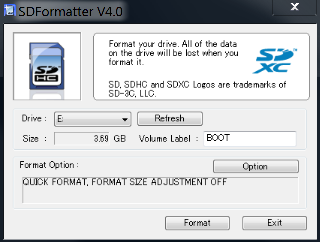
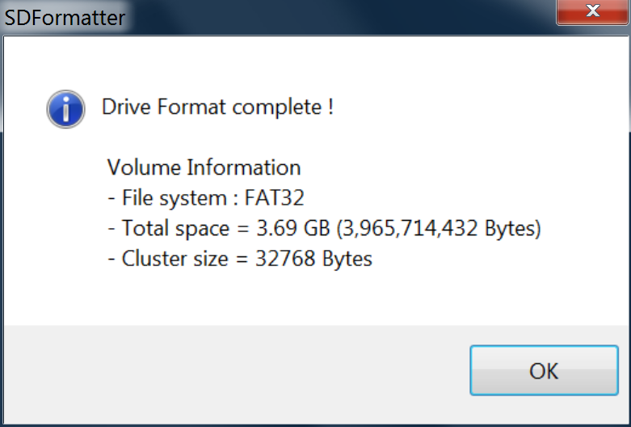
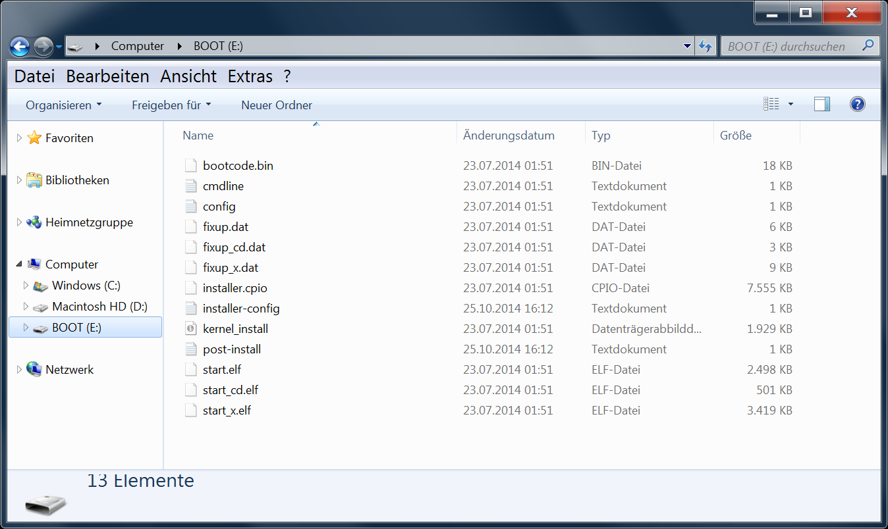

# Install *guh*-core on the Raspberry Pi
--------------------------------------------

This tutorial shows you how to install *guh* on the [Raspberry Pi](http://www.raspberrypi.org/). The easiest and recommended way is to use the [guh-netinstall](https://github.com/guh/raspbian-netinstall-config) provided by *guh* 
> Thanks to the awesome work of [raspbian-ua-netinst](https://github.com/debian-pi/raspbian-ua-netinst).

## Table of contents:

* [Install *guh* on Debian *jessie* (minimal **net-install** system)](https://github.com/guh/guh/wiki/Raspberry-Pi#install-guh-on-debian-jessie-minimal-net-install-system)
    * [1. Prepare the SD card](https://github.com/guh/guh/wiki/Raspberry-Pi#1-prepare-the-sd-card)  
    * [2. Install](https://github.com/guh/guh/wiki/Raspberry-Pi#2-install)
* [Install *guh* on Debian *jessie* (existing system)](https://github.com/guh/guh/wiki/Raspberry-Pi#install-guh-on-debian-jessie-existing-system)
* [Install *guh* on Debian *wheezy*](https://github.com/guh/guh/wiki/Raspberry-Pi#install-guh-on-debian-wheezy)
    * [Add Qt repository](https://github.com/guh/guh/wiki/Raspberry-Pi#add-qt-repository)
    * [Install *guh*](https://github.com/guh/guh/wiki/Raspberry-Pi#install-guh)

--------------------------------------------
## Install *guh* on Debian *jessie* (minimal **net-install** system)

If you want a fresh, new and minimal installation of *guh* on the [Raspberry Pi](http://www.raspberrypi.org/), we recommend to this tutorial, which will install everything you need to run *guh*. Basically you just need to do following three steps:

1. Delete all partitions of the SD card (minimal size of 1GB) and create a new single `FAT32` partition.
2. Mount the partition and unzip the latest [guh-netinstall.zip](http://www.guh.guru:8080/job/build-installer/lastSuccessfulBuild/artifact/guh-netinstall-v1.0.6.zip) file on it.
3. Insert the SD card into the Raspberry Pi, connect the network cable, connect the power cable and wait until the Raspberry Pi performs a reboot.

This procedure will install the whole system directly from the internet with the newest packages and a pre-configured *guh* installation.

--------------------------------------------
### 1. Prepare the SD card 

In this step we delete all partitions of the SD card and create a new single `FAT32` partition.

> **Note:** this will delete all data from your SD card!

--------------------------------------------
#### ...using Linux
First you need to check which device is your SD card:

> **Note:** please be very careful in this step!! You can delete your whole system if you choose the wrong device!!

    $ lsblk
    
    NAME   MAJ:MIN RM   SIZE RO TYPE MOUNTPOINT
    sda      8:0    0 465,9G  0 disk 
    ├─sda1   8:1    0   200M  0 part /boot/efi
    ├─sda2   8:2    0    45G  0 part 
    ├─sda3   8:3    0 279,4G  0 part /
    └─sda4   8:4    0 139,7G  0 part 
    sdb      8:16   1   3,7G  0 disk 
    ├─sdb1   8:17   1    56M  0 part 
    └─sdb2   8:18   1     3G  0 part 

In this case, the SD card (4 GB) is device `/dev/sdb`. Lets create a new partition table for this SD card:

    $ sudo fdisk /dev/sdb

Print the partition table using `p` to make sure this is the correct device! (In this example it is a 4GB SD card):

    Command (m for help): p
    Disk /dev/sdb: 3.7 GiB, 3947888640 bytes, 7710720 sectors
    Units: sectors of 1 * 512 = 512 bytes
    Sector size (logical/physical): 512 bytes / 512 bytes
    I/O size (minimum/optimal): 512 bytes / 512 bytes
    Disklabel type: dos
    Disk identifier: 0x00000000

    Device    Boot     Start       End  Blocks  Id System
    /dev/sdb1             16     97727   48856   b W95 FAT32
    /dev/sdb2          97728   7710719 3806496  83 Linux

Delete all partitions (using `d`, `enter`, `d`):

    Command (m for help): d
    Partition number (1,2, default 2): 
    
    Partition 2 has been deleted.

    Command (m for help): d
    Selected partition 1
    Partition 1 has been deleted.
    
Create a new dos partition table using `o`:
    
    Command (m for help): o
    Created a new DOS disklabel with disk identifier 0x2abef6c0.
    
Create a new 64MB partition (`n`, `enter`, `enter`, `enter`, `+64M`):
        
    Command (m for help): n
    
    Partition type:
       p   primary (0 primary, 0 extended, 4 free)
       e   extended
    Select (default p):
    
    Using default response p.
    Partition number (1-4, default 1): 
    First sector (2048-7710719, default 2048): 
    Last sector, +sectors or +size{K,M,G,T,P} (2048-7710719, default 7710719): +64M         

    Created a new partition 1 of type 'Linux' and of size 64 MiB.
    
Change the partition type to W95 FAT32 (`t`, `b`):
    
    Command (m for help): t
    
    Selected partition 1
    Hex code (type L to list all codes): b
    If you have created or modified any DOS 6.x partitions, please see the fdisk documentation for additional information.
    Changed type of partition 'Linux' to 'W95 FAT32'.

Now your partition table should look like this (`p`):

    Command (m for help): p
    Disk /dev/sdb: 3,7 GiB, 3947888640 bytes, 7710720 sectors
    Units: sectors of 1 * 512 = 512 bytes
    Sector size (logical/physical): 512 bytes / 512 bytes
    I/O size (minimum/optimal): 512 bytes / 512 bytes
    Disklabel type: dos
    Disk identifier: 0x2abef6c0
    
    Device     Boot Start    End Sectors Size Id Type
    /dev/sdb1        2048 133119  131072  64M 83 Linux
    
Write the partition table to the disk and exit using `w`:

    Command (m for help): w
    
    The partition table has been altered.
    Calling ioctl() to re-read partition table.
    Syncing disks.

Now you have to format the new partition to vfat (FAT32):

    $ sudo mkfs.vfat -n BOOT /dev/sdb1

Mount the SD card:
    
    $ sudo mkdir /mnt/raspberry-boot/
    $ sudo mount -t vfat /dev/sdb1 /mnt/raspberry-boot/    
    $ cd /mnt/raspberry-boot/

Download the latest latest [guh-netinstall.zip](http://www.guh.guru:8080/job/build-installer/lastSuccessfulBuild/artifact/guh-netinstall-v1.0.6.zip) file:

    $ sudo wget http://www.guh.guru:8080/job/build-installer/lastSuccessfulBuild/artifact/guh-netinstall-v1.0.6.zip

Unzip the file:

    $ sudo unzip guh-netinstall-v1.0.6.zip

Delete the zip file:

    $ sudo rm guh-netinstall-v1.0.6.zip

Umount the partition:

    $ cd ../
    $ sudo umount /dev/sdb1

Now you can continue with the installation step: [2. Install](https://github.com/guh/guh/wiki/Raspberry-Pi#2-install).

--------------------------------------------
#### ...using MacOS
In order to prepare the SD card under MacOS, you need to download the SD Formatter 4.0 for Mac. The *Disk Utility* application from MacOS some how does not format the FAT32 partition correctly. 

1. Download the the *SD Formatter 4.0* application from following link:
    [https://www.sdcard.org/downloads/formatter_4/eula_mac/](https://www.sdcard.org/downloads/formatter_4/eula_mac/)

    You need to agree to the *End User License Agreement* to download the application.
    
2. Install the application by opening the downloaded `pkg` file and following the wizard.

3. Open the application (you need to enter your password), choose "*Quick Format*" option, name the partition to "BOOT" and click the `Format` button:

    > **Note:** this will delete all data from your SD card!

    
    
4. Unzip the latest [guh-netinstall.zip](http://www.guh.guru:8080/job/build-installer/lastSuccessfulBuild/artifact/guh-netinstall-v1.0.6.zip) to the BOOT partition on the SD card:

    
    
    
Now you can continue with the installation step: [2. Install](https://github.com/guh/guh/wiki/Raspberry-Pi#2-install).

--------------------------------------------
#### ...using Windows

In order to prepare the SD card under Windows, you need to download the SD Formatter 4.0. 

1. Download the the *SD Formatter 4.0* application from following link:
    [https://www.sdcard.org/downloads/formatter_4/eula_windows/](https://www.sdcard.org/downloads/formatter_4/eula_windows/)

    You need to agree to the *End User License Agreement* to download the application.
    
2. Install the application by opening the downloaded `setup.exe` file and following the wizard.

3. Open the application, choose "*Quick Format*" option, name the partition to "BOOT" and click the `Format` button:

    > **Note:** this will delete all data from your SD card!

    
    
    

4. Unzip the latest [guh-netinstall.zip](http://www.guh.guru:8080/job/build-installer/lastSuccessfulBuild/artifact/guh-netinstall-v1.0.6.zip) to the BOOT partition on the SD card:

    
    
    
Now you can continue with the installation step: [2. Install](https://github.com/guh/guh/wiki/Raspberry-Pi#2-install).

###  2. Install
Insert your prepared SD card into your [Raspberry Pi](http://www.raspberrypi.org/), connect the ethernet cable (internet connection needed) and then connect the power supply. 

**That's it!**

Now you have to wait ~35-40 minutes. Once the installation is finished, the Raspberry Pi will reboot and boot into the new system. 

> **Note:** It's important to connect the network cable **before** you connect the power cable! DHCP will be one of the first things during the installation!

> **Note:** The **WARNINGS** (i.e. `dpkg: warning: ignoring pre-dependency problem!`) during the installation are normal.

> **Info:** You can follow the installation process if you connect the Raspberry Pi to a HDMI display! 

> **Info:** The log file of the whole *guh*-installation process can be found in `/var/log/installer.log`.

In order to check if the installation has finished you can try to connect over `ssh` to the Raspberry Pi. When the installation has finished, the Raspberry Pi will reboot and boot the fresh system...and you will be able to connect:

    $ ssh root@guh.local
    $ password: guh

> **Note:** because avahi-daemon is runing by default and the webinterface should already running you can also open following link [http://guh.local:3000](http://guh.local:3000)
Now you have a fresh, clean and minimal installation of Debian *jessie* with *guh*. The `root` password is `guh`!

You can proceed with the [[Getting started]] instructions.

--------------------------------------------
##Install *guh* on Debian *jessie* (existing system)
If you already have a Debian *jessie* installation and want to install *guh* you need to create the `/etc/apt/sources.list.d/guh.list` file and add the *guh*-repository:

1. Add the [*guh*-repo](http://repo.guh.guru/) to the source list file:
        
        $ sudo nano /etc/apt/sources.list.d/guh.list
            
    Append following two lines at the end of the file:
    
        ## guh repo
        deb http://repo.guh.guru jessie main
        deb-src http://repo.guh.guru jessie main

        > **Alternative:** `$ echo -e "\n## guh repo\ndeb http://repo.guh.guru jessie main\ndeb-src http://repo.guh.guru jessie main" | sudo tee /etc/apt/sources.list.d/guh.list`

    Add the public key of the guh-repo to your keylist:
    
        $ sudo apt-key adv --keyserver keyserver.ubuntu.com --recv-key 6B9376B0
    
2. Update your package lists:
    
        $ sudo apt-get update
    
    The *guh*-repository provides following packages:
    
        $ apt-cache search guh
    
        guh - Server for home automation systems - meta package
        guh-cli - guh command line interface - python
        guh-dbg - server for home automation systems - debug symbols
        guh-doc - Documentation for the guh package (on-site) - documentation
        guh-plugins - Plugins for guh server home automation systems
        guh-tests - Tests for the guh package
        guh-webinterface - Browser based user interface for guh
        guh-webserver - A REST-API webserver for the guh-webinterface
        guhd - Server daemon for home automation systems
        libguh1 - Server for home automation systems - core library
        libguh1-dev - Server for home automation systems - development files

3. Install *guh* with following command:
    
        $ sudo apt-get install guh guh-webserver libgl1-mesa-dev
        
    The repository contains always the latest stable build of the *guh* `master` branch. 
    If you want to install the source code you can install:
        
        $ sudo apt-get source guh
        $ sudo apt-get source guh-webserver
        $ sudo apt-get source guh-webinterface

Once, the installation is finished you continue with the [[Getting started]] instruction.

--------------------------------------------
## Install *guh* on Debian *wheezy*

> Coming soon...

### Add Qt repository
       
> Thanks to [Sébastien Noel](http://twolife.be/raspbian/)!!

Add the *twolife.be* repository source list:

    $ sudo echo "deb http://twolife.be/raspbian/ wheezy main backports" >> /etc/apt/sources.list.d/twolife.list
    $ sudo echo "deb-src http://twolife.be/raspbian/ wheezy main backports" >> /etc/apt/sources.list.d/twolife.list

Download the public key:

    $ sudo apt-key adv --keyserver keyserver.ubuntu.com --recv-key 2578B775

Update to fetch the new package list:

    $ apt-get update    
    
### Install *guh*

> Coming soon...

