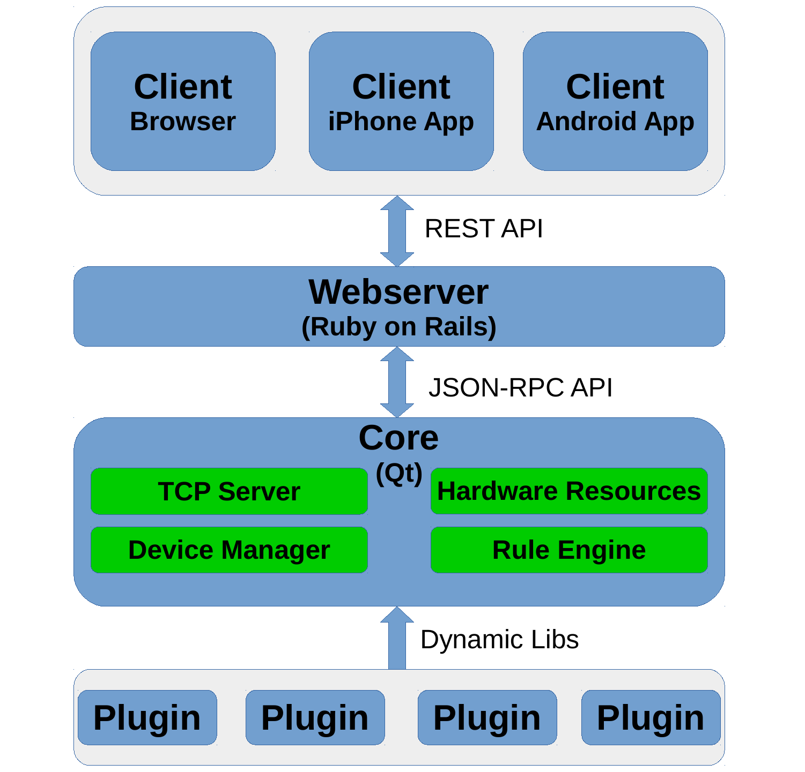

# Structure of *guhOS*
--------------------------------------------
The whole system has basically three layers:

1. [*guh*-daemon:](https://github.com/guh/guh) the core is an application written in [Qt](http://qt-project.org/) and contains the whole communication with the hardware, loads the supported devices from the plugins, manages all devices and rules. The core provides a JSON-RCP API to allow clients to communicate with the core.

2. [*guh*-webserver:](https://github.com/guh/guh-webserver) the *guh*-webserver is an application written in [Go](http://golang.org/) and contains a web server which provides a REST API. This application communicates directly with the core and translates the JSON-RPC from the core to the REST API.

3. [*guh*-webinterface:](https://github.com/guh/guh-webinterface) the *guh*-webinterface application is an application written in [AngularJS](https://angularjs.org/) and provides the browser based user interface for *guh*. The application uses the REST API from the guh-webserver and offers the user an easy and beautiful possibility to interact with his home. 

In following figure you can see the structure of the whole system:

    

