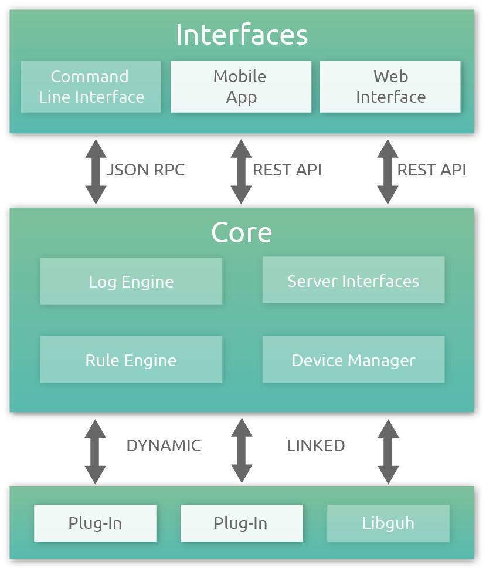

# Structure of *guhIO*
--------------------------------------------
The whole system has basically three layers:

1. [*guh*-daemon:](https://github.com/guh/guh) the guh-daemon (the core) is an application written in [Qt](http://qt-project.org/) and contains the whole communication with the hardware, loads the supported plugins and devices and manages all devices and rules. The core provides a JSON-RCP API to allow clients to communicate with the core.

2. [*guh*-cli:](https://github.com/guh/guh-cli) the guh-cli (command line interface) is an admin tool written in [python](https://www.python.org/) to communicate with the guh JSON-RPC API and test functionality of guh.

3. [*guh*-webinterface:](https://github.com/guh/guh-webinterface) the *guh*-webinterface application is an application written in [AngularJS](https://angularjs.org/) and provides the browser based user interface for *guh*. The application uses the REST API from the guh-webserver and offers the user an easy and beautiful possibility to interact with the system. 

In following figure you can see the structure of the whole system:

    

