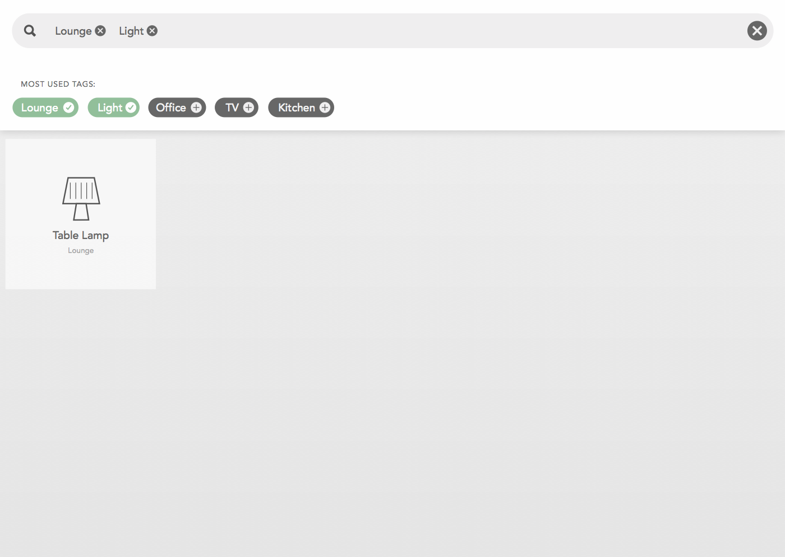

# Clients
--------------------------------------------

Since you have successfully installed guhIO, you are now in the lucky position to choose between two user interfaces. Each of the UI's has it's own advantages.

The web interface is currently the most convenient way to interact with guhIO.
For development, debugging or complex rules we recommend to use the command line interface.

Smartphone Apps are available soon! 

# Web Interface

guhIO has a built in web server. Open your preferred browser and type in the address of your device guhIO is running on.

If you don't know how to access the web server, take a look at the [getting started wiki](https://github.com/guh/guh/wiki/Getting-started#access-the-web-interface)

The web interface is in an early development stage, in a couple of weeks it will look as fancy as the examples on this site. Just watch out for updates!

***

* **Web Interface Login Screen**

***

* **Web Interface Device Screen**

***

* **Web Interface Device Search**

***

* **Web Interface Dashboard**

***

## Command Line Interface
--------------------------------------------

The *guh-cli* (command line interface) is an admin tool written in python to communicate with the [*guh*](https://github.com/guh/guh) JSON-RPC API and test functionality of *guh*.

Take a look at the [getting started wiki](https://github.com/guh/guh/wiki/Getting-started#guh-cli) for more information.

* **Start Screen V1.0.3**

* **Devices Screen V1.0.3**

